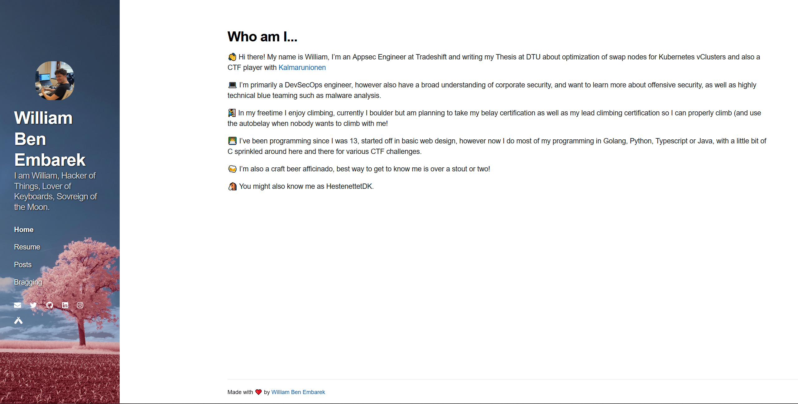

# Daydream

Welcome to my Jekyll theme, its pretty basic, there isn't really much more too it.\



A live demo can also be seen [here](https://embar.io).

Theme is also somewhat mobile friendly!

This theme should be accessability friendly as its just HTML and CSS, but no gaurantees there, I am not a frontend developer.

Photo by [Wolfgang Hasselmann](https://unsplash.com/@wolfgang_hasselmann?utm_source=unsplash&utm_medium=referral&utm_content=creditCopyText) on [Unsplash](https://unsplash.com/@wolfgang_hasselmann?utm_source=unsplash&utm_medium=referral&utm_content=creditCopyText)
  

## Installation

### Standalone Jekyll
Add this line to your Jekyll site's `Gemfile`:

```ruby
gem "daydream-theme"
```

And add this line to your Jekyll site's `_config.yml`:

```yaml
theme: daydream-theme
```
as well as 
```yaml
cover: /assets/img/bg.jpg
```

And then execute:

    $ bundle

Or install it yourself as:

    $ gem install daydream


### Github Pages

To install on github pages instead add this line to your `GemFile` under the jekyll plugins group:
```ruby
  gem "jekyll-remote-theme"
```

then in your Jekyll site's `_config.yml`:
```yaml
remote_theme: williambenembarek/daydream-theme
```

## Usage

Edit config, replace bg.jpg if you want to, add a picture called me.jpg in `assets/me.jpg` to include a picture.

## _config.yml fields
Following fields are added on top of the default config.
```yml
tagline: This is the tagline bewlow the title
cover: define a custom sidebar image
```

### Navigation
For navigation links create the folder `_data` and within it the file `navigation.yml`, use the following format.
```yaml
- title: Home
  url: /
- title: ...
  url: /.../
```

### Social
For social links create the folder `_data` and within it the file `social.yml`, use the following format.

```yaml
- title: Email
  url: mailto:<name>@<domain>
  icon: fas fa-envelope
- title: Twitter
  url: https://twitter.com/<username>
  icon: fab fa-twitter
```

### Creating a default home page

In the root of the website create a index.md file, in here include the frontmatter
```yml
---
layout: page
title: <TITLE HERE>
permalink: /
---
```

### Creating an overview of all posts

If you added a default home page you would then have lost the default overview of all posts, this is probably the wrong way to go about things but here is how I fixed it.
In the root of the website create a posts.md file, in here paste the following.
```html
---
layout: page
title: Posts
permalink: /posts/
---
<ul>

  
    <li>
      <a href="{{ post.url }}">
        {{ post.title }}
      </a>
      - <time datetime="{{ post.date | date: "%Y-%m-%d" }}">{{ post.date | date_to_long_string }}</time>
    </li>
    
        {{ post.excerpt | truncate: 256 }}  
    
  
```

### Removing / Editing the "Made with ❤️ by William Ben Embarek" from the footer

Create the folder `_includes`.
Within it create the file `footer.html`
Paste in the following and edit it

```html
<footer class="footer">
    <small>
      Made with ❤️ by <a ref=https://github.com/williambenembarek>William Ben Embarek</a>
    </small>
</footer>
```

## TODO
 - Add dark mode toggle, if you end up implementing this please send me a PR! Would be apprciated :)
 - Make mobile friendly (Somewhat done, can 100% be improved)

## Contributing

Bug reports and pull requests are welcome on GitHub at https://github.com/williambenembarek/daydream-theme. This project is intended to be a safe, welcoming space for collaboration, and contributors are expected to adhere to the [Contributor Covenant](http://contributor-covenant.org) code of conduct.

## Development

To set up your environment to develop this theme, run `bundle install`.

Your theme is setup just like a normal Jekyll site! To test your theme, run `bundle exec jekyll serve` and open your browser at `http://localhost:4000`. This starts a Jekyll server using your theme. Add pages, documents, data, etc. like normal to test your theme's contents. As you make modifications to your theme and to your content, your site will regenerate and you should see the changes in the browser after a refresh, just like normal.

When your theme is released, only the files in `_layouts`, `_includes`, `_sass` and `assets` tracked with Git will be bundled.
To add a custom directory to your theme-gem, please edit the regexp in `daydream.gemspec` accordingly.

## License

The theme is available as open source under the terms of the [High Five License](LICENSE.txt).

